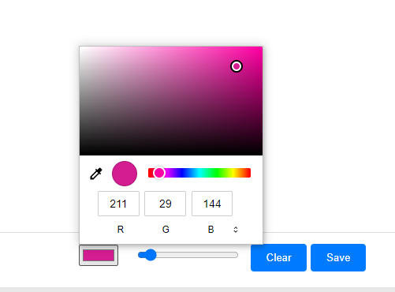
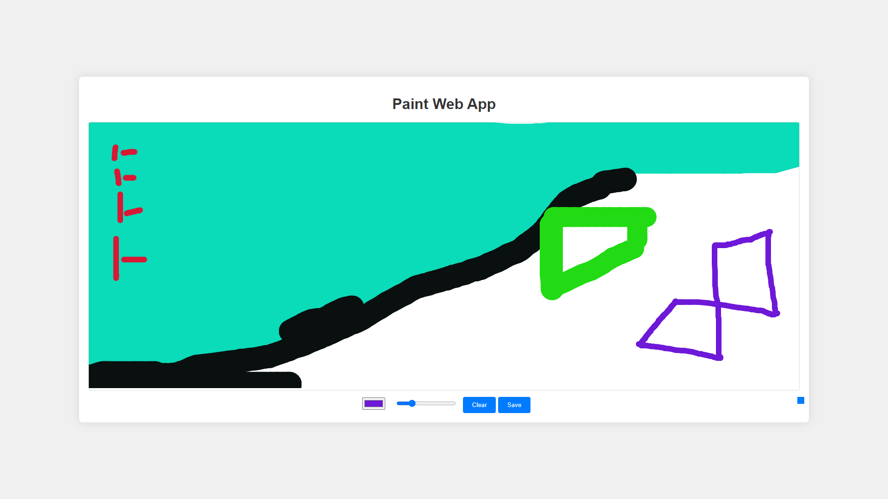

## Getting Started
To use, [simply open the hosted app in your web browser.](https://funny-rabanadas-0f5f32.netlify.app/). You can start drawing immediately without any setup required.

Work in progress, only works on desktop. 

## Paint Web App
Welcome to the Paint Web App! This simple yet powerful app allows you to unleash your creativity by painting on a digital canvas. With various features such as color selection, brush size adjustment, and the ability to save your creations.

## Features
Canvas Drawing: Use your mouse to draw anything you want on the canvas.

Color Selection: Choose from a wide range of colors using the color picker.

Brush Size Adjustment: Customize the size of your brush to fit your drawing needs.

Clear Canvas: Easily clear the canvas to start a new masterpiece.

Save Your Artwork: Save your creations as PNG files to share or print them later.


## Usage
Drawing: Click and drag your mouse on the canvas to draw.

Color Selection: Use the color picker to choose your desired color.

Brush Size: Adjust the brush size using the slider.

Clear Canvas: Click the "Clear" button to erase everything on the canvas.

Save Artwork: Click the "Save" button to download your drawing as a PNG file.

## Screenshots






## Installation

1. Clone the repository:
    ```bash
    git clone https://github.com/yourusername/PaintWebApp.git
    ```
2. Navigate to the project directory:
    ```bash
    cd PaintWebApp
    ```
## Contributing

1. Fork the repository.
2. Create a new branch:
    ```bash
    git checkout -b feature-branch
    ```
3. Make your changes.
4. Commit your changes:
    ```bash
    git commit -m "Add new feature"
    ```
5. Push to the branch:
    ```bash
    git push origin feature-branch
    ```
6. Open a pull request..


## Technologies Used
HTML5
CSS3
JavaScript
